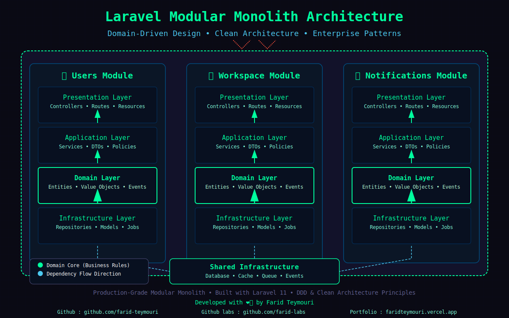

<br>

# Modular Architecture Laravel (Monolith API)

A production-grade Laravel modular monolith demonstrating **Domain-Driven Design**, **Clean Architecture**, and **Enterprise Patterns**. Built for scalability, maintainability, and developer experience. <br>

[](https://github.com/farid-labs/modular-architecture-laravel/actions)
[](LICENSE)

## 🎯 Architecture Highlights

### 🏗️ Modular Monolith Structure

- **Bounded Contexts**: Users, Billing, Notifications modules with clear boundaries
- **Domain-Driven Design**: Entities, Value Objects, Repositories, Services
- **Layered Architecture**: Presentation → Application → Domain → Infrastructure

### ⚙️ Core Patterns & Practices

#### **Domain Layer**

- **Entities**: Rich domain models with business logic
- **Value Objects**: Immutable objects representing concepts
- **Repositories**: Interface segregation for data access
- **Domain Events**: Event-driven architecture within modules

#### **Application Layer**

- **Service Layer**: Application-specific business logic
- **DTOs**: Data Transfer Objects for clean boundaries
- **Commands**: CQRS-inspired command pattern
- **Policies**: Authorization logic separated from controllers
- **Validators**: Form request validation with custom rules

#### **Infrastructure Layer**

- **Repository Pattern**: Eloquent implementations with interfaces
- **Caching Strategy**: Redis-backed caching with cache invalidation
- **Queue System**: Job dispatching for async operations
- **Event Listeners**: Decoupled event handling

### 🗄️ Technology Stack

- **Framework**: Laravel 11.x
- **Database**: PostgreSQL 15 (Enterprise-grade)
- **Cache/Queue**: Redis 7.x
- **Containerization**: Docker & Docker Compose
- **Testing**: PHPUnit with 85%+ coverage target
- **CI/CD**: GitHub Actions for automated testing & deployment

## 📦 Module Structure

Each module follows the same architectural pattern:

```bash
Module/
├── Application/ # Use cases, services, DTOs
├── Domain/ # Entities, value objects, domain logic
├── Infrastructure/ # Persistence, caching, jobs
└── Presentation/ # API controllers, routes, resources
```

## 🚀 Quick Start

### Prerequisites

- Docker & Docker Compose
- PHP 8.2+ (for local development)
- Composer

### Installation

```bash
# Clone repository
git clone https://github.com/farid-labs/modular-architecture-laravel.git
cd modular-architecture-laravel

# Copy environment file
cp .env.example .env

# Start containers (this will build images and start services)
docker compose up -d

# Wait for containers to be ready (optional but recommended)
sleep 5

# Install PHP dependencies
docker compose exec app composer install

# Generate application key
docker compose exec app php artisan key:generate

# Run migrations and seeders
docker compose exec app php artisan migrate:fresh --seed

# Install frontend dependencies (if needed)
# docker compose exec app npm install
```

### 🧪 Testing Strategy

```bash
# Run all tests
docker compose exec app php artisan test

# Run unit tests only
docker compose exec app php artisan test --testsuite=Unit

# Run feature tests only
docker compose exec app php artisan test --testsuite=Feature

# Run tests with coverage
docker compose exec app php artisan test --coverage

# Run specific test file
docker compose exec app php artisan test --filter=UserControllerTest
```

### Development Commands

```bash
# Access application container
docker compose exec app bash

# View logs
docker compose logs -f app

# Restart services
docker compose restart

# Stop all services
docker compose down

# Stop and remove all containers, networks, and volumes
docker compose down -v
```

### API Documentation

```bash
# Generate Swagger/OpenAPI documentation
docker compose exec app php artisan l5-swagger:generate

# Access API documentation at:
# http://localhost:8080/api/documentation
```

### Accessing the Application

- API Base URL: `http://localhost:8080/api/v1`
- API Documentation: `http://localhost:8080/api/documentation`
- Telescope (if enabled): `http://localhost:8080/telescope`

### Default Test User

#### After running migrations with seeders, you can use this user for testing:

```json
{
    "email": "admin@faridlabs.com",
    "password": "password"
}
```

## 📊 Code Quality

- PSR-12 coding standards
- PHPStan level 8 static analysis
- PHPUnit with comprehensive test coverage
- Laravel Pint for code formatting

## 🔐 Security

- Rate limiting on all API endpoints
- CSRF protection
- SQL injection prevention (Eloquent ORM)
- XSS protection (Blade escaping)
- Secure password hashing (bcrypt)

## 📈 Performance Optimizations

- Redis Caching: Query result caching with TTL
- Queue Workers: Async job processing
- Database Indexing: Optimized queries
- Eager Loading: N+1 query prevention
- Response Caching: API response caching

## 🤝 Contributing

### This repository demonstrates engineering excellence. Contributions that maintain architectural integrity are welcome.

1. Fork the repository
2. Create feature branch (git checkout -b feature/amazing-feature)
3. Commit changes (git commit -m 'Add amazing feature')
4. Push to branch (git push origin feature/amazing-feature)
5. Open Pull Request

## 📄 License

MIT License - see <a href="" >LICENSE</a> file for details

## 👨‍💻 About Farid Labs

### Engineering-focused repositories exploring software architecture, scalable systems, and modern web technologies.

#### 🔗 Portfolio: https://faridteymouri.vercel.app/

---

Built with ❤️ and engineering excellence
